# The Mule

A Hilux-style 4x4 double-cab pickup for Route 13: the **Mule** from the
[design doc](../../../docs/GAME_DESIGN.md#cars) ("Toughest; crew in the bed can
shoot (and be shot)"). Practical, a little dusty, nothing flashy: white
paint, black six-spoke wheels on all-terrain tyres, a usable bed and a
plain cab with four seats sized for Roblox characters.

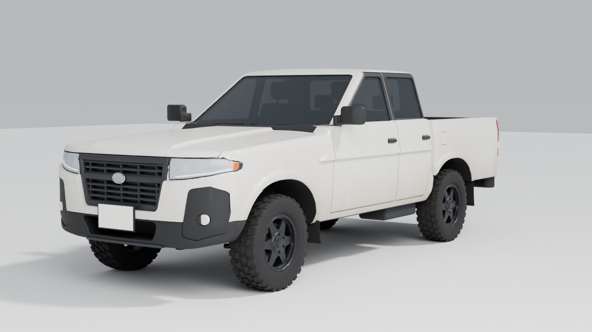

| | |
|---|---|
| Size | **22.4 × 9.4 × 7.7 studs** (length × width with mirrors × height); 5.28 × 2.22 × 1.81 m at 4.25 studs per metre |
| Triangles | **97,178** total; largest single mesh 7,815 (`Body_Cab`) (Roblox allows 20,000 per MeshPart) |
| Meshes | 126 MeshParts, one material each, named by what they are |
| Seats | 4: driver `VehicleSeat` + passenger + two rear `Seat`s, cleared for seated R15 avatars |
| Wheels | 4 wheel models (tyre, rim, brake) + a spare under the bed; tyre radius 1.64 studs |
| Textures | optional dust/wear sets (paint, bedliner, tyres), 1024 px |

| | | |
|---|---|---|
| 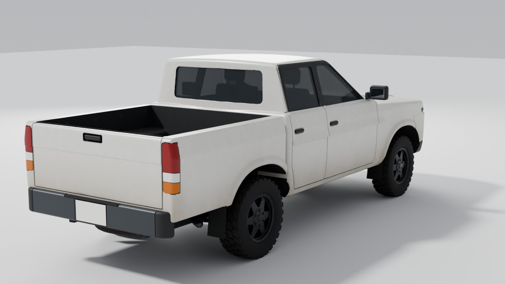 | 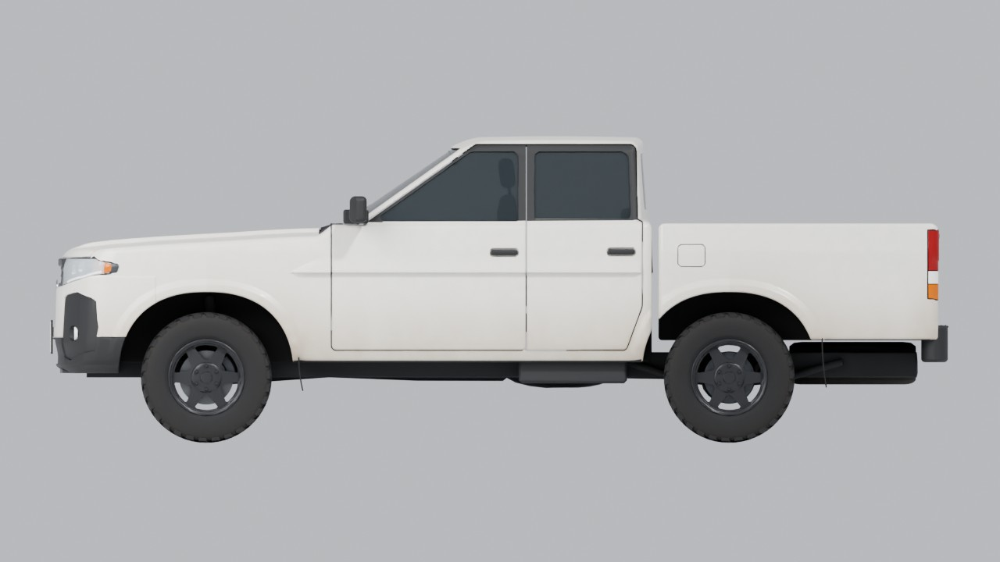 | 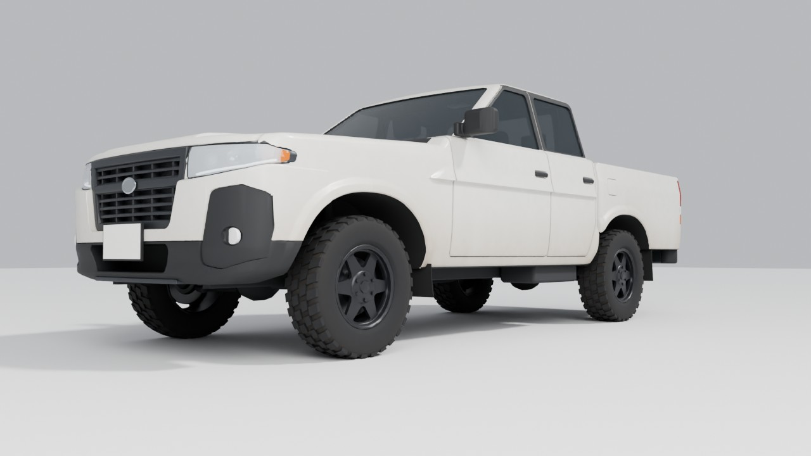 |
| 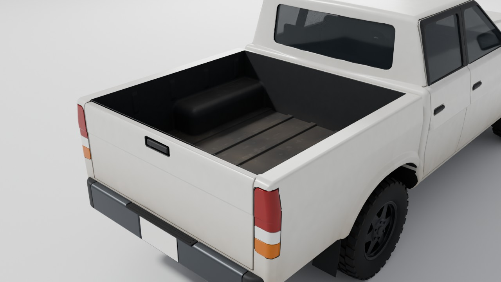 | 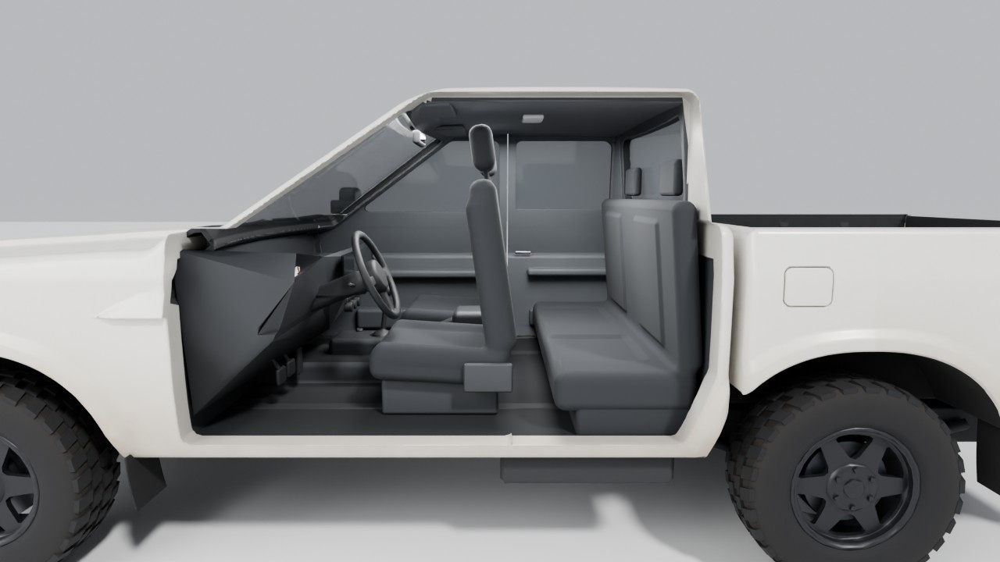 | 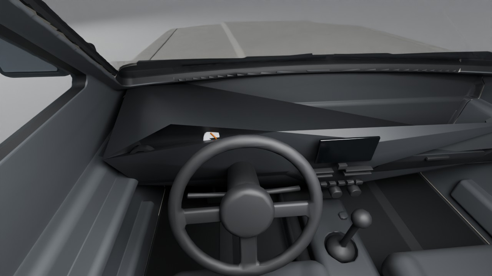 |
| 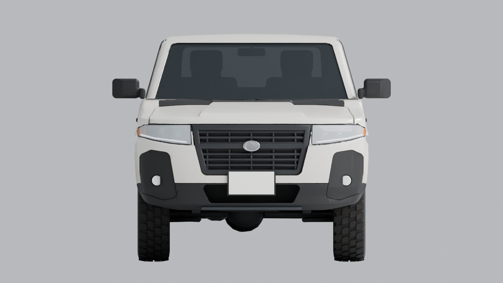 | 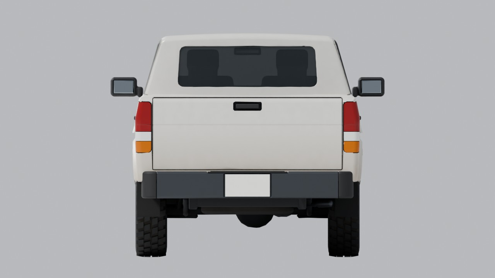 | 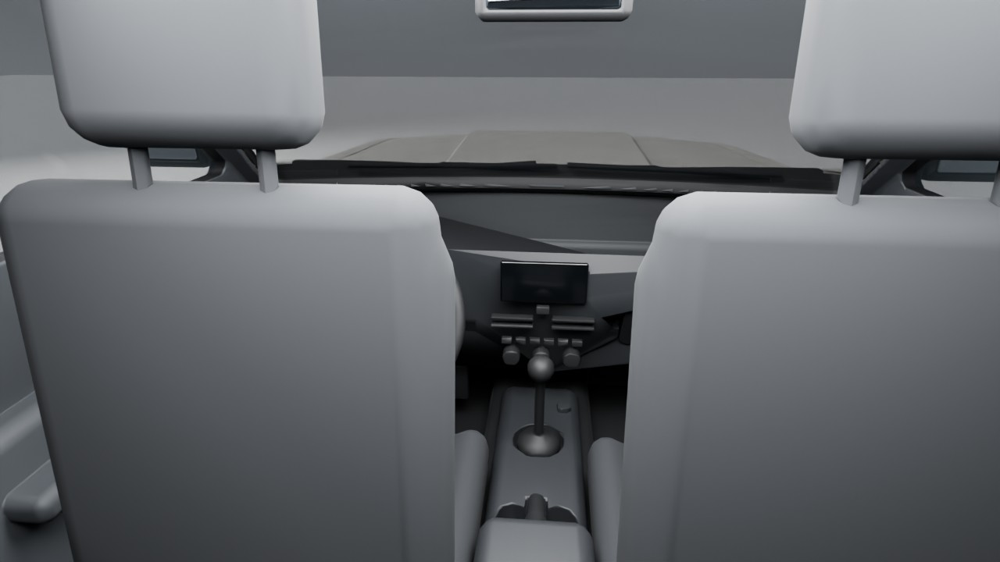 |
| 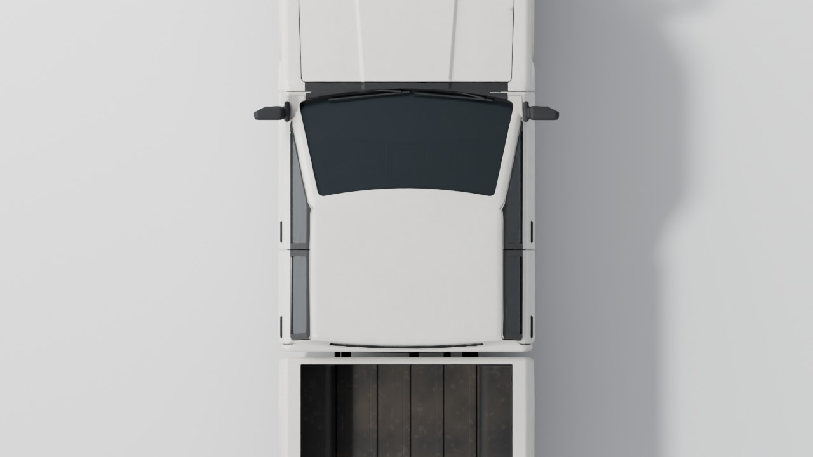 | | |

## Files

| File | What it is |
|---|---|
| `mule_pickup.fbx` | The model for Roblox Studio, 1 unit = 1 stud, textures embedded. |
| `mule_pickup.glb` | Same model as glTF binary. |
| `mule_pickup.blend` | Blender source in metres with materials and packed textures. |
| `textures/` | `mule_paint_*`, `mule_bedliner_*`, `mule_tire_*` colour and roughness maps. |
| `roblox/MuleSetup.lua` | ModuleScript that finishes the model in Studio (materials, seats, colliders, welds, lights). |
| `mule_manifest.json` | Every part: material, triangle count, pivot and size in studs; seat and wheel positions. |
| `previews/` | The renders on this page. |

## Importing into Roblox Studio

1. **Import 3D** → pick `mule_pickup.fbx`.
2. In the importer: **File Geometry → Scale Unit = Stud**, **File Transform → World Forward = Front, World Up = Top**. Leave meshes unmerged so every part keeps its own material.
3. Check the result: the `Mule` model should measure about **22.4 studs** long, with the grille facing the model's front (−Z). If it comes in 100× off, re-import with Scale Unit set to Stud; if it faces backwards, set World Forward to Back.
4. Put `roblox/MuleSetup.lua` in `ReplicatedStorage` as a ModuleScript named `MuleSetup`.
5. Once, from the **command bar**: `require(game.ReplicatedStorage.MuleSetup).StudioPrep(workspace.Mule)`. This sets every MeshPart to Box collision fidelity, which game scripts are not allowed to change.
6. From a server Script:

   ```lua
   local MuleSetup = require(game.ReplicatedStorage.MuleSetup)
   MuleSetup.Setup(workspace.Mule)                 -- materials, seats, colliders, welds
   MuleSetup.SetLights(workspace.Mule, { Head = true, Tail = true })
   ```

   `Setup` takes `{ seats, colliders, weld, skipWheels, frontPlate }` (all optional) and is safe to run twice. Pass `skipWheels = true` if your chassis (A-Chassis or the custom one from the design doc) drives the `Wheel_*` models itself.
7. Optional wear textures: upload the six PNGs in `textures/` as Images, paste their `rbxassetid://` ids into `MuleSetup.Textures`, and `Setup` adds a `SurfaceAppearance` to the painted panels, the bedliner and the tyres. Without them the truck uses flat Roblox materials, which already look clean and consistent.

## How the model is organised

```
Mule
├─ MuleRoot          invisible 1×1×1 stud box between the axles at axle height (PrimaryPart)
├─ Body              cab, bed, hood, bumpers, grille, cowl, mirrors, handles, wipers, mud flaps
├─ Doors             Door_FL/FR/RL/RR (paint, black window sash, inner trim), glass, inner handles
├─ Lights            headlights (lens, housing, reflector, DRL, indicator), fogs, tail lights, plate lamp
├─ Glass             windshield and rear window
├─ Wheels            Wheel_FL/FR/RL/RR → Tire, Rim, Disc or Drum (spin), Caliper (does not spin)
├─ Interior          seats, dashboard, cluster, screen, vents, controls, glovebox, steering, console, pedals...
├─ Seats             SeatAnchor_Driver/Passenger/RearLeft/RearRight (Setup swaps these for real seats)
├─ Underbody         frame, axles, diffs, springs, exhaust, spare
└─ Plates            Plate_Rear, Plate_Front + PlateBracket_Front
```

- Every mesh has one material, so in Studio each part is a single `Color` + `Material`. Panels that mix colours in real life are split: `Door_FL` (paint), `Door_FL_TrimBlack` (window sash), `Door_FL_DoorTrim` (inside panel), and so on.
- Doors pivot on their hinges, the hood on its rear edge and the tailgate on its bottom edge, so they can be animated open later.
- Wheel parts pivot on the wheel centre.
- Panel gaps are real 5 mm gaps between separate meshes, not painted lines.

## Seats

| Seat | Kind | Cushion top centre (studs from MuleRoot: X, Y, Z) |
|---|---|---|
| Driver | `VehicleSeat` | -1.53, 1.68, 0.65 |
| Passenger | `Seat` | 1.53, 1.68, 0.65 |
| RearLeft | `Seat` | -1.53, 1.64, 3.54 |
| RearRight | `Seat` | 1.53, 1.64, 3.54 |

The cabin was laid out around a seated R15 character at 4.25 studs per metre:
the head top sits about 3.7 studs above the cushion and clears the headliner,
the knees clear the seat in front, and the outer arm stays inside the door.
Roblox avatars are 4 studs wide, which is wider than two people fit in any
real cab, so something has to give: the front pair's inner arms overlap over
the console, inside the cab where it can't be seen from outside. In the
worst case (arms hanging straight down, as in the blocky stand-ins below)
the top of the outer shoulder grazes the side glass by about a centimetre.
A custom seated animation with the arms forward (hands on the wheel or the
knees) removes both.

| | |
|---|---|
| 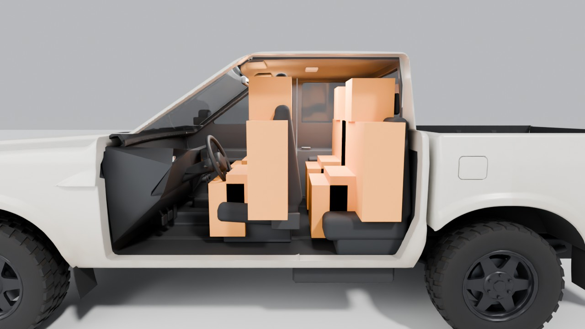 | 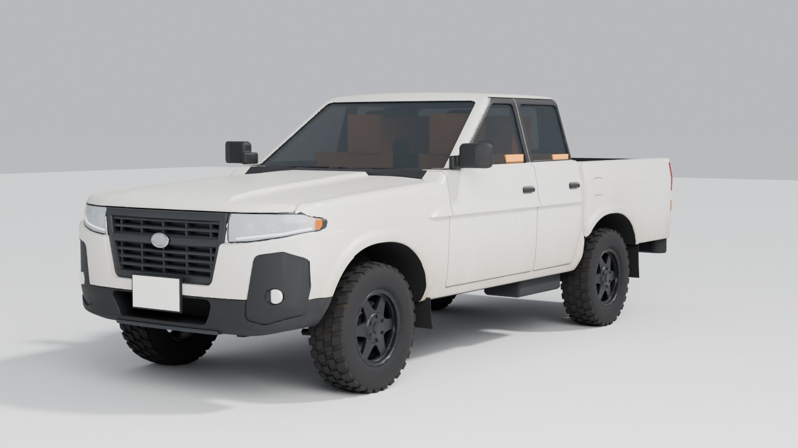 |

## Collision

The visual meshes are `CanCollide = false`. `Setup` adds invisible boxes in
a `Colliders` folder: nose, cab, greenhouse, bed floor, bed walls, tailgate
and rear bumper. The bed floor is flat, so crew can stand and walk in it,
and the cab and bed block line of sight for the plate-swap witness checks
(they keep `CanQuery = true`).

## Lights

`MuleSetup.SetLights(model, state)` switches groups on and off: `Head`
(DRLs, headlight lenses with a forward `SpotLight`, fogs), `Tail`, `Brake`,
`Reverse`, `TurnLeft`, `TurnRight`. Lit parts turn `Neon`; unlit parts go
back to their palette material.

## Licence plates

`Plate_Rear` sits in the step bumper's plate recess. Its rear face is
UV-mapped 0..1, so a plate texture (`SurfaceAppearance` or `Decal`) or a
`SurfaceGui` drops straight on; the plate lamp above it lights it at night.
`Plate_Front` and `PlateBracket_Front` are the **Two-Faced Car** upgrade
(design doc 2.9): `Setup` hides them, `MuleSetup.SetFrontPlate(model, true)`
shows them.

## Materials

| Palette key | Used for | Roblox material | Colour |
|---|---|---|---|
| `Paint` | body panels, hood, doors, bed, tailgate, front bumper | SmoothPlastic | `#D8D6CF` |
| `TrimBlack` | window sashes and seals, cowl, mirrors, handles, fog bezels, lower bumper, wipers | Plastic | `#1F2022` |
| `TrimDark` | grille, headlight surrounds | SmoothPlastic | `#2B2D30` |
| `Chrome` | headlight reflectors, front badge | Metal | `#B4B8BC` |
| `Gunmetal` | rear step bumper, skid plate, exhaust, headlight housings, calipers, drums | Metal | `#4A4D51` |
| `Rubber` | tyres, mud flaps, step pad | Rubber | `#1B1B1C` |
| `Glass` | windows (tinted) | Glass, 45% transparent | `#2E3539` |
| `LensClear` | headlight lenses | Glass, 60% transparent | `#D5DCE2` |
| `LensRed` | brake/tail lights | SmoothPlastic, 10% transparent | `#8C1C1C` |
| `LensAmber` | indicators, gauge needles | SmoothPlastic, 10% transparent | `#C2690F` |
| `LensWhite` | reverse lights, fog lamps, plate lamp, dome light | SmoothPlastic, 5% transparent | `#E4E5E2` |
| `LightDRL` | daytime running lights | SmoothPlastic | `#F3F5F8` |
| `MirrorGlass` | mirror glass | Glass | `#8E959B` |
| `Bedliner` | bed floor and inner walls | Plastic | `#28292B` |
| `WheelWell` | wheel arch liners | Plastic | `#19191A` |
| `Underbody` | frame, axles, body underside | Plastic | `#2A2B2D` |
| `InteriorTrim` | pillar trims, rear wall, seat bases | SmoothPlastic | `#3A3C3F` |
| `DoorTrim` | door panels, sun visors | SmoothPlastic | `#4E5155` |
| `Headliner` | roof lining | Fabric | `#5D5F63` |
| `FloorRubber` | floor | Rubber | `#1C1D1F` |
| `Dash` | dashboard, glovebox, console | SmoothPlastic | `#2A2C2F` |
| `SeatFabric` | seats | Fabric | `#2E3033` |
| `MetalAccent` | interior door handles | Metal | `#8B8F94` |
| `Screen` | radio screen | Glass | `#0D0F11` |
| `Gauge` | instrument dials | SmoothPlastic | `#C9CDD2` |
| `RimPaint` | wheels | SmoothPlastic | `#26272A` |
| `BrakeDisc` | front discs | Metal | `#6C6E70` |
| `Plate` | licence plates | SmoothPlastic | `#ECECE6` |
| `Anchor` | seat anchors, MuleRoot (invisible) | SmoothPlastic, 100% transparent | `#4FA3FF` |

## Triangle budget

| Group | Triangles |
|---|---|
| Body | 38,254 |
| Wheels | 20,584 |
| Interior | 15,336 |
| Doors | 9,984 |
| Lights | 8,656 |
| Underbody | 3,388 |
| Glass | 940 |
| Plates | 36 |
| **Total** | **97,178** |

## Rebuilding

Everything here is generated by [`tools/mule`](../../../tools/mule/README.md):
change a number, rebuild, re-import.

## Notes

- There is no Roblox Studio in the environment that built this, so the import was not tried in Studio itself. The FBX settings follow Roblox's documented Blender workflow, the FBX was re-imported into Blender to check its size and parts, and `MuleSetup.lua` was compiled and run against a mocked Roblox API (`tools/mule/luau_test`).
- No manufacturer logos: the front badge is a plain oval.
