# Port Solace: Town Map & World Design

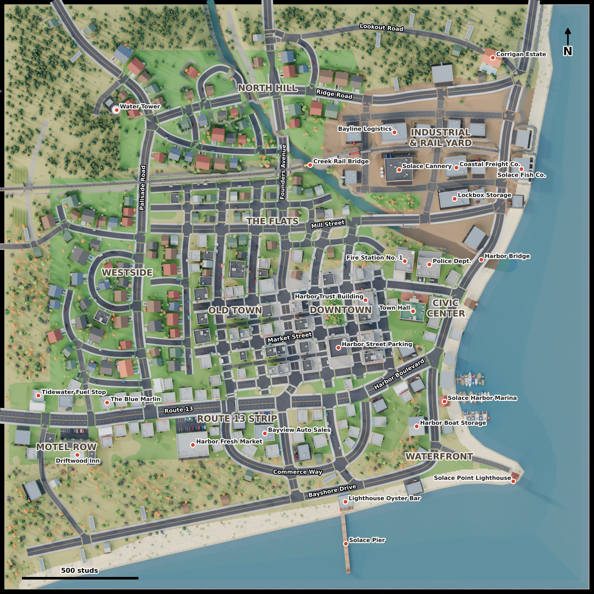

Port Solace is a fading cannery and harbour town at the point where Route 13 meets the sea.
It is a sandbox for a stylized crime game. Old money lives up on the bluff, the
cannery still smokes, and the motels on the highway rent by the hour. The marina moves
more than fish, and the police station sits two blocks from the pawn shops.

The whole town is original and procedurally assembled from hand-designed parts. Every
building is a real, enterable structure. Rooms come first, then walls, doors, windows,
stairs and roofs are derived from them, so every window looks into a furnished room, every
floor is reachable, and roofs, basements, back rooms and garages are part of the playable
space. For the pipeline, see [`blender/README.md`](../blender/README.md). For every
building with its coordinates, see [`TOWN_DIRECTORY.md`](TOWN_DIRECTORY.md).

| | |
|---|---|
| Map | 2560 × 2560 studs (1 Blender unit = 1 stud); dense core ≈ 1900 studs |
| Buildings | 263, all enterable, ~2,700 rooms, 857 entrances (every building has at least 2) |
| Roads | 51 named roads, 35k studs of road, 103 junctions (40 signalised), 5 road bridges |
| Rail | freight line on an embankment, 5 underpasses, a truss bridge, a rail yard with a parked train |
| Water | the sea to the south and east, a beach, a marina with 3 docks, and a creek from the hills to the harbour mouth |
| Life | ~25k furniture and fixtures, ~8k street props, ~4k trees and plants, ~5.5k scheduled lights |
| Roblox | 5 × 5 streaming chunks of 512 studs, native parts plus voxel terrain (see the README) |

## Layout

North is up. The **sea** wraps the town on the east and south. A wide **beach** with a
fishing pier runs along the south shore, and the **marina** and **Solace Point
Lighthouse** sit on the south-east point.

**Downtown** is a compact grid, tilted 8°, in the middle of town. The **Civic Center**
lies on its east side, between downtown and the harbour. **Solace Creek** comes down from
the northern hills, curves east past the rail yard and reaches the sea under the Harbor
Bridge. North of downtown, a **freight line** on a 14-stud embankment crosses the whole
map from west to east and ends in the rail yard behind the cannery.

```
                 N
   woods / Water Tower Hill        North Hill homes        fields   Corrigan Bluff
   ──────────────── rail embankment ═══════════════════ rail yard · CANNERY · storage
   Westside homes    THE FLATS (creek)          INDUSTRIAL · fish plant
   (cul-de-sacs)     OLD TOWN │ DOWNTOWN │ CIVIC ── Harbor Bridge ── sea
   MOTEL ROW ── Route 13 ── COMMERCIAL STRIP ──────── WATERFRONT · marina
   gas · diner · motel        supermarket · dealer      Oyster Bar · lighthouse
   ─────────────── beach ─────────── pier ─────────────────────── sea
```

## Gallery

| | |
|---|---|
| 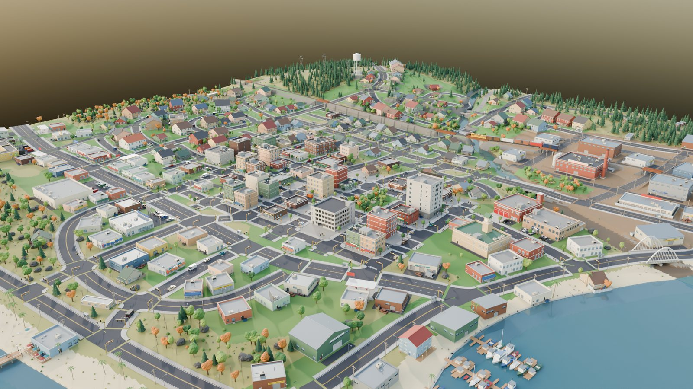 | 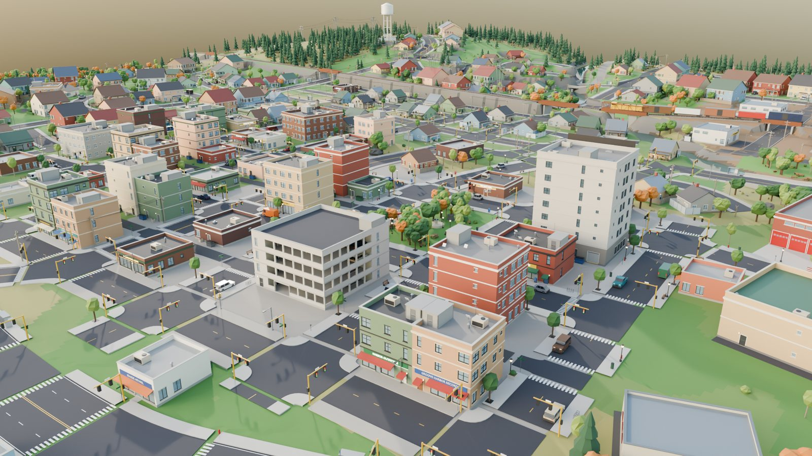 |
| *Aerial view from over the harbour* | *Downtown, with the Harbor Trust Building and the parking garage* |
| 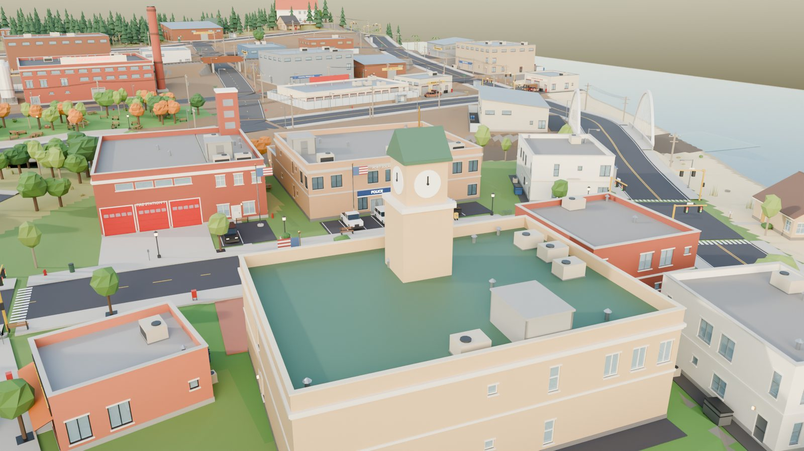 | 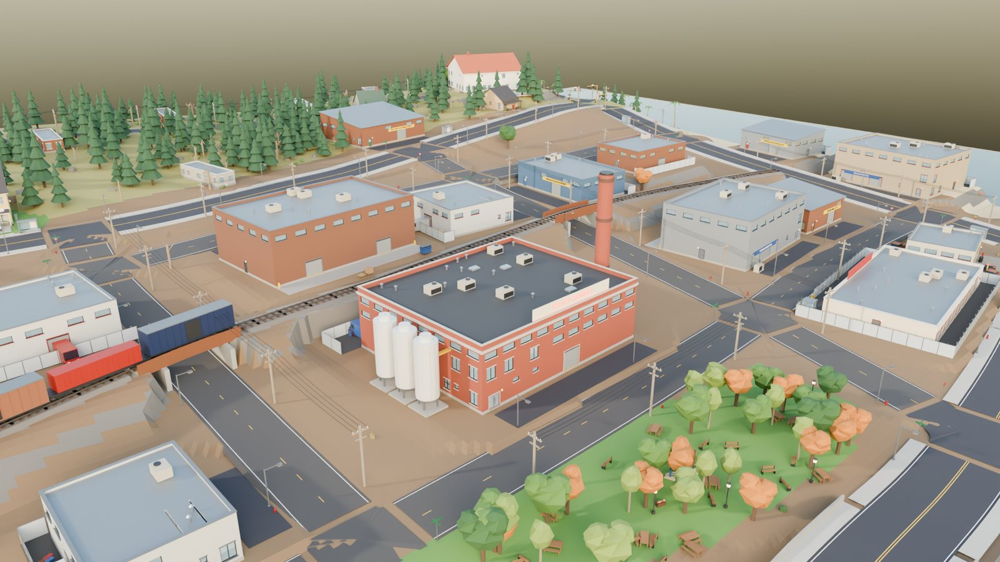 |
| *Civic Center: the town hall clock tower, police, fire station and Harbor Bridge* | *The cannery, rail line and Riverside Park* |
| 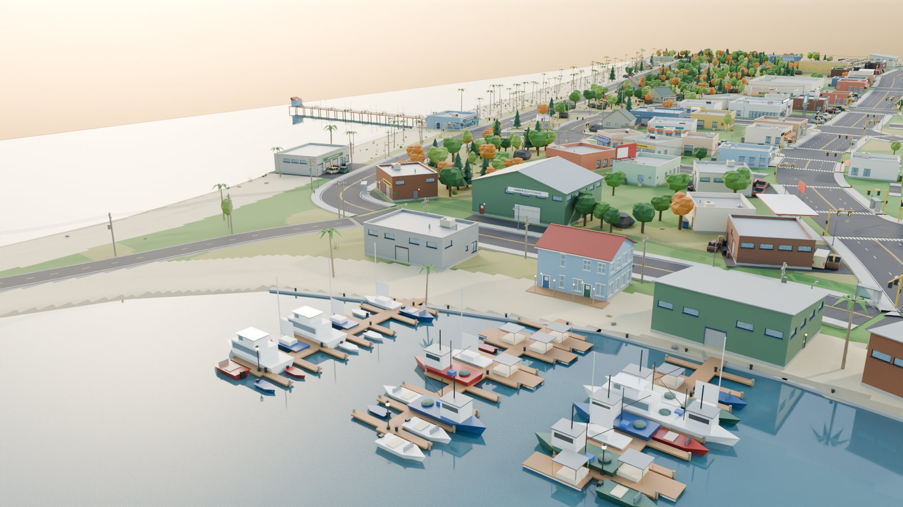 | 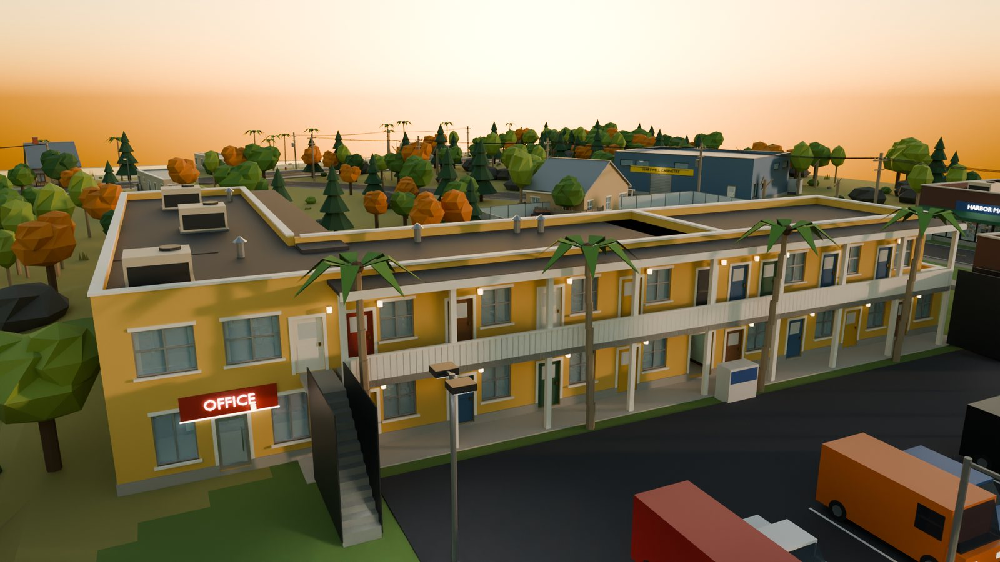 |
| *The marina and the beach* | *Motel Row at dusk* |
| 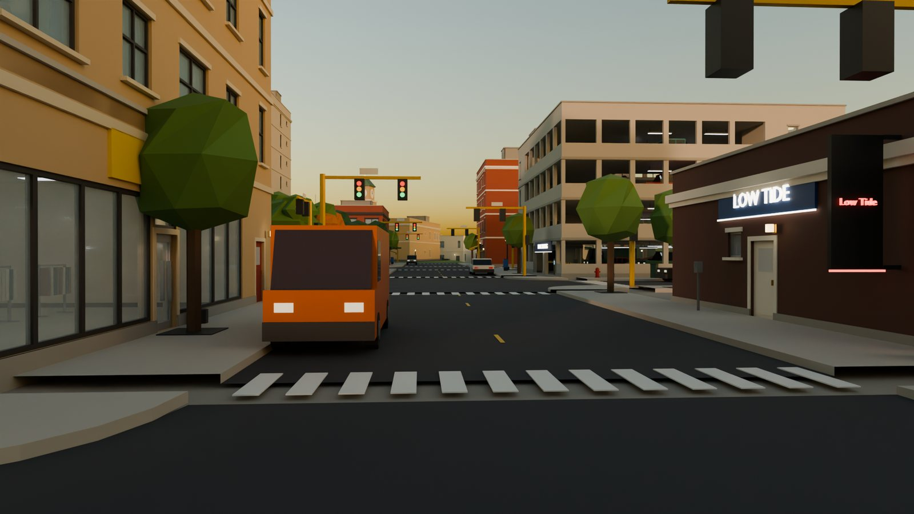 | 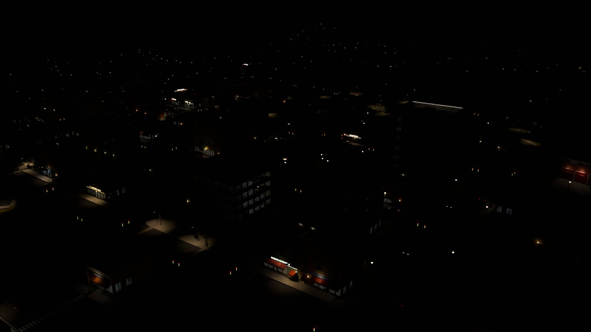 |
| *Street level on Market Street* | *Downtown after dark* |

## Districts

### Downtown

The tilted grid has four avenues and three streets (Front, Market and Bell), with
service alleys behind the blocks: Fishmonger, Chandler and Net Loft. The ground is paved
hardscape, with street trees, benches, news boxes, hydrants and traffic signals at the
junctions.

* **Buildings.** Brick and stucco blocks of two to four storeys stand on the sidewalk.
  Most are mixed-use: a shop on the ground floor and apartments above, with their own
  street door, stair and corridor. There are also bars with keg cellars and pawn shops.
* **Harbor Trust Building.** The town's tallest building has seven floors. It has a
  lobby, a corner cafe, a newsstand, a mail and loading room, a security office, an
  elevator shaft with a lobby on every floor, open-plan floors with private suites and
  meeting rooms, and a roof.
* **Harbor Street Parking.** A four-deck garage with ramps, two stair towers, a ticket
  booth and parked cars.
* **Town Square.** A lawn park with trees and benches in the middle of the grid.
* **Interiors.** High detail: decor, clutter, lit display windows and upper-floor
  apartments with lived-in clutter.
* **Play.** Dense cover, short sight lines, and flat roofs with parapets and roof
  hatches that form rooftop routes. The alleys give escape routes, and the garage is the
  place to swap vehicles.

### Civic Center

This district lies along Civic Center Drive, between downtown and the harbour.

* **Port Solace Town Hall.** It has a public service hall, the town clerk, permits and
  licensing, a double-height council chamber, a records vault and building services. The
  upper floor holds the mayor's office, council offices, a planning room and the archive.
  Outside are a portico, a clock tower and a front plaza.
* **Port Solace Police Department.**
  * Front of house: a public lobby, front desk, records and admin, two interview rooms
    and the detectives' office.
  * Through the secure corridor: the patrol bullpen, the briefing room, the evidence
    room, men's and women's lockers, a cell block with four holding cells, and a sally
    port garage with equipment storage.
  * Upstairs: the chief's office, administration, the command conference room, the
    dispatch center, a server room and investigations.
  * Outside: a fenced police lot with cruisers.
* **Fire Station No. 1.** The double-height apparatus bay has three doors front and back,
  with engines parked inside. There are also a watch office, station kitchen, day room
  and turnout gear room. Upstairs are the bunk room, showers, lounge and captain's office.
  A hose tower stands outside.
* **Small offices.** Insurance, realty and legal offices.

### Old Town (mixed use)

The older blocks west of downtown hold shops with flats above and three- and four-storey
apartment blocks.

* **Apartment blocks.** They have basements with a boiler room, electrical room and
  tenant storage. Each has a lobby, a stair stacked to the roof, a laundry room, studio,
  one- and two-bedroom units, and steel fire escapes.
* **Other buildings.** Bars, laundromats, pawn shops, small restaurants and a few old
  houses.
* **Interiors.** Worn and mid-quality, and some units are cheap.

### Route 13 commercial strip

Route 13 enters town from the south-west.

* **Harbor Fresh Market.** A supermarket with a sales floor of aisles, produce and
  checkouts, plus a receiving stockroom, cold storage, a break room and the manager's
  office.
* **Bayview Auto Sales.** A dealership with a showroom, sales offices, a service desk
  with parts, a lounge and service bays, and a lot of cars for sale.
* **Strip shops.** Pharmacy, hardware, electronics, clothing and furniture stores, all
  stocked to suit their trade.
* **Roadside.** Diners, gas stations with convenience stores, auto repair shops,
  billboards and big parking lots.

### Motel Row

This is the roadside entrance on Route 13, at the west edge of town.

* **Driftwood Inn.** An L-shaped, two-storey motel with 26 rooms. Each room has its own
  bath and an outside door onto the walkway or gallery. There are also a front office,
  staff room, housekeeping laundry, an ice and vending nook, a manager's flat, a pool,
  pole signs and a lit VACANCY sign.
* **The Blue Marlin.** A diner with a big marlin sign on the roof. Inside are a dining
  room, kitchen, walk-in, dry storage and staff office.
* **Tidewater Fuel Stop.** A gas station.
* **Other buildings.** Roadside bars, an auto shop and trailers.
* **Play.** Busiest after dark. The motel rooms make cheap safehouses.

### Waterfront & marina

This is the south-east shore, plus the fish plant on the north harbour.

* **Solace Harbor Marina.** Bait and tackle, the harbourmaster, boaters' showers, a crew
  lounge and sail-loft storage, with a dockmaster lookout upstairs. Three floating docks
  have moored boats.
* **Harbor Boat Storage.** A boat barn, an engine shop and a sail loft.
* **Lighthouse Oyster Bar.** A restaurant on the beach.
* **Other buildings.** Harbour sheds, the seawall and the public fishing pier.
* **Solace Fish Co.** A fish processing plant with a processing floor, cold storage and
  an office block.
* **Solace Point Lighthouse.**
  * The keeper's house holds the **Dust FM** radio studio, a kitchen, a bedroom and the
    record library.
  * The tower has six levels of stairs up to the lantern room and an outside gallery.
  * Its beam rotates at night in Roblox.

### Industrial & rail yard

This is the north-east, between the rail line and the harbour.

* **Solace Cannery.** The factory has a production hall, a maintenance shop with a parts
  loft, a plant lobby, locker rooms and a canteen. Upstairs are the control room and the
  plant manager's office. The site has a smokestack, silos and five loading doors.
* **Lockbox Storage.** A gated self-storage yard with a rental office, a security room,
  an indoor unit corridor and 30 units, including drive-up roll-up units.
* **Warehouses.** Bayline Logistics and Coastal Freight Co. are tall racked halls with
  dock doors and a two-storey office block.
* **Workshops.** Fabrication shops, a plumbing supply, a machine shop and similar.
* **Rail yard.** Sidings with a parked freight train, on Cannery Row, Kiln Street, Depot
  Street and Foundry Road.
* **Grounds.** Dirt yards, fences, containers, pallets and loading docks.

### The Flats (low income)

This area lies between downtown and the rail line, along the creek. It has small old
houses, some of them abandoned with dark windows. There are also trailers, a corner store,
laundromats and chain-link fences around overgrown yards. **Creek Green** is a small park
on the creek. The interiors are cheap and cluttered.

### Westside and North Hill (residential)

* **Westside.** Suburban streets and cul-de-sacs, such as Gull Court and Cypress Court,
  with small and two-storey houses. They have driveways, garages with cars, fenced
  backyards and lawns.
* **North Hill.** Curving streets, such as Harbor View Circle and Heron Loop, with bigger
  houses and views over town.
* **Houses.** They have foyers, living and family rooms, kitchens, laundry and mudrooms,
  and bedrooms upstairs, including kids' rooms, a main suite and baths. Every house has a
  front door and a back or side door.

### Outskirts

* **Landscape.** Woods on the north-west hills, farm fields, dirt roads, a junkyard,
  trailers and old farmhouses.
* **Port Solace Water Tower.** On Water Tower Hill, with a pump house, a ladder and a
  catwalk lookout.
* **Corrigan Estate.** On the bluff above the sea in the north-east, reached by Lookout
  Road. It is a large estate with a pool, a gallery, a study, a guest room and a
  garage.

## Landmarks

| # | Landmark | Where | Notes |
|---|---|---|---|
| 1 | **Solace Point Lighthouse** | south-east point | 7-level tower, lantern room, rotating beam, Dust FM studio |
| 2 | **Harbor Bridge** | Bayshore Drive over the creek mouth | twin steel arches, the town's postcard view |
| 3 | **Harbor Trust Building** | downtown | 7 storeys, tallest building, roof access |
| 4 | **Town Hall clock tower** | Civic Center | portico, plaza, council chamber |
| 5 | **Solace Cannery smokestack** | industrial | visible from everywhere, silos, rail yard |
| 6 | **Port Solace Water Tower** | Water Tower Hill | climbable, catwalk lookout over the whole map |
| 7 | **Solace Pier** | beach | long fishing pier, vantage at the end |
| 8 | **The Blue Marlin sign** | Motel Row | rooftop marlin over the diner |
| 9 | **Driftwood Inn** | Motel Row | neon pole signs, pool, 26 rooms |
| 10 | **Creek Rail Bridge** | rail over Solace Creek | steel truss on the embankment |
| 11 | **Corrigan Estate** | Corrigan Bluff | the rich end of town |
| 12 | **Solace Harbor Marina** | waterfront | docks, boats, bait shop |
| 13 | **Harbor Street Parking** | downtown | 4-deck garage, rooftop vantage |
| 14 | **Town Square** | downtown | the park in the middle of the grid |

## Roads and routes

| Class | Width (studs) | Roads |
|---|---|---|
| Major | 52 | Route 13 (the highway in from the west), Harbor Boulevard |
| Arterial | 36 | Bayshore Drive (coastal ring, 3.9k studs), Founders Avenue, Mill Street, Palisade Road, Ridge Road, Commerce Way |
| Street | 32 | the downtown grid, Cannery Ave, Lighthouse Ave, Pier St, Elm St, Oak St, Tidewater Ave, Civic Center Dr |
| Residential | 24 | 17 neighbourhood streets, loops and courts |
| Service | 30 | Foundry Rd, Cannery Row, Depot St, Kiln St (truck routes) |
| Alley | 14 | Fishmonger, Chandler and Net Loft alleys behind downtown |
| Rural / dirt | 24 / 18 | Old Mission Rd, Point Rd, Quarry Rd, Old County Rd, Lookout Rd, Bluff Rd, Farm Lane, Creekside Trail |

* **No plain grid.** Downtown is a tilted grid. Everything else follows the terrain,
  the coast and the creek, with curves, loops, T-junctions and cul-de-sacs (Gull Court,
  Cypress Court, Wren Court, Seaview Terrace, Birch Lane, Northgate Avenue). Bayshore
  Drive rings the coast.
* **Crossings.** Five road bridges cross the creek: the Harbor Bridge on Bayshore Drive,
  plus the Founders Avenue, Mill Street, Ridge Road and Heron Loop bridges. The rail
  embankment crosses Palisade Road, Founders Avenue, Kiln Street, Cannery Row and Farm
  Lane in underpasses.
* **Getaways.** Downtown alleys, the rail underpasses, Creekside Trail along the water,
  the farm and quarry dirt roads, the beach, and a boat from the marina.
* **Police response.** Units leave the sally port onto Civic Center Drive. Founders
  Avenue and Bayshore Drive then take them anywhere in town within a few hundred studs.

## Interiors

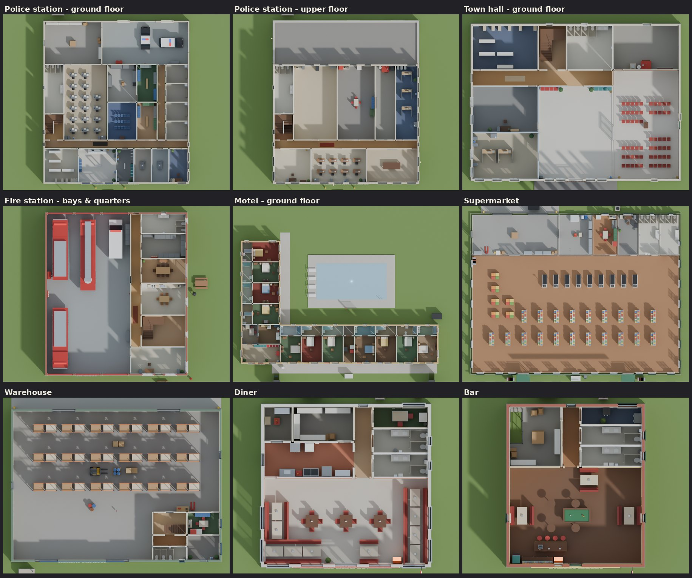

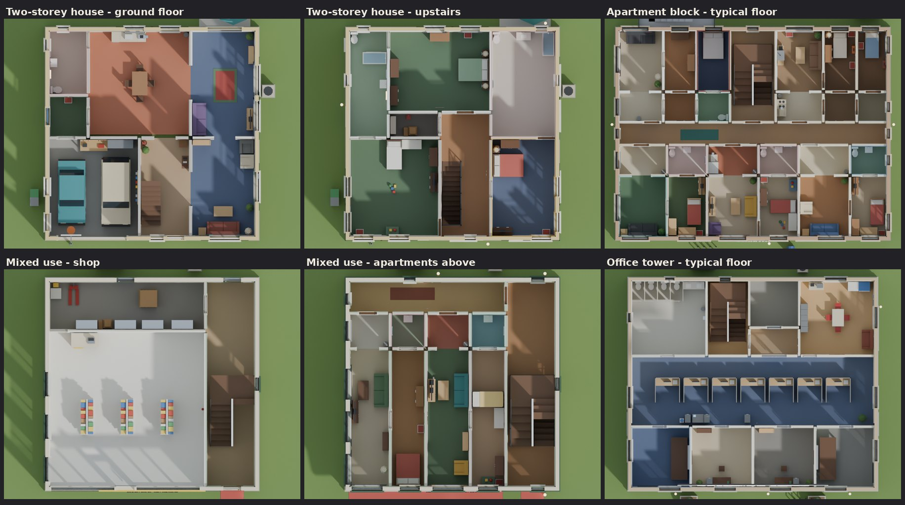

*Sample floor plans of the building archetypes, rendered top-down with the roof cut away.*

* **Continuity.** Facades are generated from the floor plans. Windows appear only where a
  room meets an outside wall, with sill and head heights set by the room's kind. Interior
  walls, stairs, slabs and ceilings come from the same plan, so no fake fronts or empty
  boxes are possible.
* **Access.** Every building has a main entrance plus at least one more: secondary,
  service, loading, garage, staff, vehicle bays and so on. Multi-storey buildings have
  real stairs (straight, U-shaped or ramps). 29 buildings have roof access and 40 have
  basements, and the apartment blocks have fire escapes.
* **Detail.** High detail covers landmarks, downtown, civic, mixed-use, waterfront and
  motel buildings: full decor and clutter. Medium detail covers commercial, residential
  and industrial buildings: complete furnishing and lighter clutter. Outskirts buildings
  are simplified, with the essentials only. All of them can be entered.
* **Character by district.** Furnishing follows each room's kind (about 100 kinds, from
  `holding cell` to `walk-in cooler` to `kids' room`). Quality varies by district:
  cheap, normal, nice or abandoned. Quality changes the finishes, the fabrics and how
  much gets furnished, and abandoned buildings keep their fixtures but stay dark.

## Gameplay spaces

These are marked in the Roblox build as invisible parts, tagged with CollectionService.

* **Safehouses (17):**
  * starter trailers in the outskirts
  * two Driftwood Inn rooms
  * downtown and Old Town apartments
  * Flats basements and front rooms
  * the Corrigan Estate, the high-end tier
* **Hideouts (6):** workshops and chop-shop repair bays.
* **Stashes (14):** storage units, warehouse offices, pawn shop intake rooms and bar
  keg cellars.
* **Vantage points:**
  * the water tower catwalk
  * the end of the pier
  * the lighthouse gallery
  * the top deck of the parking garage
  * every flat roof with a hatch
* **Vehicles:** about 250 parked cars in garages, driveways and lots; police cruisers and
  fire engines at their stations; boats at the docks; and a freight train in the yard.
* **Other markers:**
  * entrances, with a role and a door kind
  * stairs, roof access, ladders and fire escapes
  * bus stops, fuel pumps, gates and docks
  * bridges, underpasses, parks and POIs

## Light and atmosphere

* **Default time.** Late afternoon (Roblox `ClockTime` 17.6), with low warm sun from the
  west-south-west, long shadows, light haze and gentle bloom.
* **Dusk to night.** The runtime script moves the clock forward:
  * Sodium street lights come on first.
  * Neon signs brighten on the bars, the diner, the motel and the gas stations.
  * Homes light up one by one on per-house schedules, and shops close up.
  * The cannery keeps a few work lights burning.
  * The lighthouse beam sweeps the bay.
* **Lights.** About 5,500 scheduled lights in all, both interior and exterior.

## Roblox notes

* **Chunks.** 25 chunks of 512 studs. Buildings are grouped per building (Exterior,
  Interior, Props, Fixtures and Signs Models), and infrastructure is grouped by category
  and chunk. `StreamingEnabled` is supported.
* **Geometry.** Everything is native Parts using real Roblox materials: about 370k parts
  with every interior, or about 158k as shells only. `interiorFilter` (for example,
  landmarks plus downtown only) and chunk subsets scale it down for weaker devices.
* **Terrain.** Voxel terrain with sea and creek water, cleared from inside buildings and
  from above roads.
